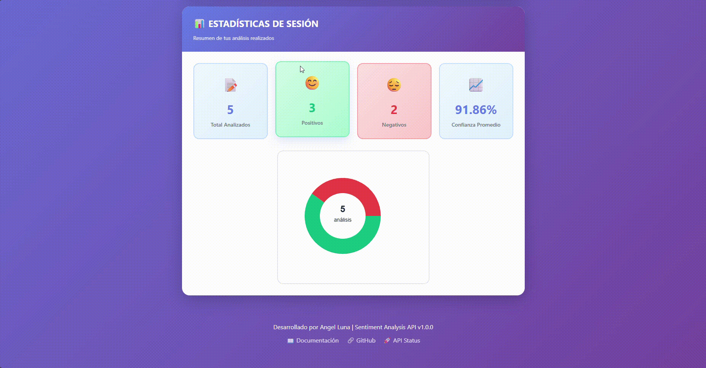

# 🎯 Sentiment Analysis Multilingual API - Full Stack Project

<div align="center">


**Sistema completo de análisis de sentimientos en tiempo real usando Machine Learning y arquitectura de microservicios.**
<br>
_Propuesta de solución desarrollada para el Hackathon ONE II - Latam_

[🌐 Demo en Vivo](#) | [📚 Documentación](#instalación) | [🐛 Reportar Bug](https://github.com/AngelLuna476/sentiment-analysis-fullstack/issues)

</div>

---

## 📋 Tabla de Contenidos

- [🌟 Características](#-características)
- [🏗️ Arquitectura](#️-arquitectura)
- [🛠️ Tecnologías](#️-tecnologías)
- [📊 Rendimiento del Modelo](#-rendimiento-del-modelo)
- [🚀 Instalación](#-instalación)
- [💻 Uso](#-uso)
- [📸 Screenshots](#-screenshots)
- [🔌 API Endpoints](#-api-endpoints)
- [🎓 Aprendizajes](#-aprendizajes)
- [🤝 Contribuir](#-contribuir)
- [📄 Licencia](#-licencia)
- [👤 Autor](#-autor)

---

## 🌟 Características

### ✨ Funcionalidades Principales

- ✅ **Análisis Individual**: Clasifica textos como Positivo/Negativo con probabilidad y confianza
- ✅ **Análisis Multilingüe**: Soporte para español, inglés, portugués, francés, italiano y alemán
- ✅ **Análisis Batch (CSV)**: Procesa hasta 1000 textos simultáneamente
- ✅ **Explicabilidad**: Muestra las palabras más influyentes en cada decisión
- ✅ **Threshold Personalizable**: Ajusta el umbral de decisión según necesidades
- ✅ **Estadísticas en Tiempo Real**: Dashboard con métricas de uso
- ✅ **Historial de Análisis**: Guarda los últimos 10 análisis de la sesión
- ✅ **Comparador de Threshold**: Analiza el mismo texto con 3 umbrales diferentes
- ✅ **Exportación de Resultados**: Descarga resultados en CSV o JSON

### 🎯 Características Técnicas

- 🏗️ **Arquitectura de Microservicios**: Separación entre Data Science (Python) y Backend (Java)
- 🔄 **API RESTful**: Endpoints documentados con Swagger/OpenAPI
- 🎨 **Frontend Responsive**: Interfaz moderna con navegación por pestañas
- 📊 **Modelo ML**: F1-Score de **96.52%** con TF-IDF + Naive Bayes
- 🌍 **Traducción Automática**: Integración con Google Translate API
- ⚡ **Procesamiento Rápido**: < 1 segundo por análisis individual

---

## 🏗️ Arquitectura
```
┌─────────────────────────────────────────────────────┐
│                    USUARIO                          │
│              (Navegador Web)                        │
└────────────────────┬────────────────────────────────┘
                     │
                     ▼ HTTP Request
┌─────────────────────────────────────────────────────┐
│            FRONTEND (HTML/CSS/JS)                   │
│  • Interfaz de usuario                              │
│  • Visualización de resultados                      │
│  • Gráficos y estadísticas                          │
└────────────────────┬────────────────────────────────┘
                     │
                     ▼ API REST (Puerto 8080)
┌─────────────────────────────────────────────────────┐
│        BACK-END JAVA (Spring Boot 3)                │
│  • Validación de datos                              │
│  • Manejo de errores                                │
│  • Orquestación de servicios                        │
│  • Persistencia (opcional)                          │
└────────────────────┬────────────────────────────────┘
                     │
                     ▼ HTTP Request (Puerto 8000)
┌─────────────────────────────────────────────────────┐
│          API PYTHON (FastAPI)                       │
│  • Carga del modelo ML                              │
│  • Traducción automática                           │
│  • Predicción de sentimientos                       │
│  • Explicabilidad                                   │
└────────────────────┬────────────────────────────────┘
                     │
                     ▼
┌─────────────────────────────────────────────────────┐
│           MODELO ML (Naive Bayes)                   │
│  • TF-IDF Vectorization                             │
│  • Clasificación binaria                            │
│  • 96.52% F1-Score                                  │
└─────────────────────────────────────────────────────┘
```

---

## 🛠️ Tecnologías

### 🐍 Data Science

| Tecnología | Versión | Uso |
|------------|---------|-----|
| Python | 3.14 | Lenguaje principal |
| Pandas | 2.x | Manipulación de datos |
| scikit-learn | 1.8.0 | Machine Learning |
| Jupyter | - | Notebooks de análisis |

### ☕ Backend Java

| Tecnología | Versión | Uso |
|------------|---------|-----|
| Java | 17/21 | Lenguaje principal |
| Spring Boot | 3.2.1 | Framework web |
| Maven | 3.x | Gestión de dependencias |
| Lombok | - | Reducción de boilerplate |

### 🐍 API Python

| Tecnología | Versión | Uso |
|------------|---------|-----|
| FastAPI | 0.109 | Framework web |
| Uvicorn | 0.27 | Servidor ASGI |
| deep-translator | - | Traducción automática |
| joblib | 1.4 | Serialización del modelo |

### 🎨 Frontend

| Tecnología | Uso |
|------------|-----|
| HTML5 | Estructura |
| CSS3 | Estilos y animaciones |
| JavaScript (Vanilla) | Lógica e interactividad |
| Canvas API | Gráficos de estadísticas |

---

## 📊 Rendimiento del Modelo

### Métricas en Dataset de Prueba (34,561 reseñas)

| Métrica | Valor | Estado |
|---------|-------|--------|
| **F1-Score** | **96.52%** | ✅ Excelente |
| Accuracy | 93.87% | ✅ Muy bueno |
| Precision | 96.93% | ✅ Muy bueno |
| Recall | 96.12% | ✅ Muy bueno |

### Distribución del Dataset

- **Positivos**: 88.63% (30,632 reseñas)
- **Negativos**: 11.37% (3,929 reseñas)
- **Ratio**: 7.80:1 (desbalanceado)

### Técnica de Balanceo

Se utilizó `class_weight='balanced'` en el modelo para manejar el desbalanceo.

### Limitaciones Conocidas

⚠️ **Negaciones complejas**: El modelo TF-IDF tiene dificultad con textos como "No me gusta" (detecta "gusta" como positivo). Se recomienda usar textos directos como "Horrible" o "Excelente".

---

## 🚀 Instalación

### Prerrequisitos

- **Java**: 17 o superior
- **Python**: 3.8 o superior
- **Maven**: 3.6 o superior
- **Git**: Para clonar el repositorio

### 1️⃣ Clonar el Repositorio
```bash
git clone https://github.com/AngelLuna476/sentiment-analysis-fullstack.git
cd sentiment-analysis-fullstack
```

### 2️⃣ Configurar API Python (FastAPI)
```bash
# Ir a la carpeta de la API
cd sentiment-api

# Crear entorno virtual
python -m venv venv

# Activar entorno virtual
# En Windows:
venv\Scripts\activate
# En Linux/Mac:
source venv/bin/activate

# Instalar dependencias
pip install -r requirements.txt

# Ejecutar API
uvicorn app.main:app --reload --host 0.0.0.0 --port 8000
```

La API estará disponible en: **http://localhost:8000**

Documentación: **http://localhost:8000/docs**

### 3️⃣ Configurar Back-End Java (Spring Boot)
```bash
# Ir a la carpeta del backend (en otra terminal)
cd sentiment-backend

# Compilar y ejecutar con Maven
mvnw.cmd spring-boot:run
# En Linux/Mac:
./mvnw spring-boot:run
```

El backend estará disponible en: **http://localhost:8080**

Health check: **http://localhost:8080/api/health**

### 4️⃣ Abrir Frontend

Simplemente abre el archivo en tu navegador:
```bash
cd sentiment-frontend
# Abrir index.html en tu navegador
```

O usa un servidor local:
```bash
# Con Python
python -m http.server 3000

# O con Node.js (http-server)
npx http-server -p 3000
```

---

## 💻 Uso

### 📝 Análisis Individual

1. Ve a la pestaña **"📝 Analizar"**
2. Escribe o pega el texto a analizar
3. (Opcional) Ajusta el **threshold** y selecciona el **idioma**
4. Haz clic en **"🚀 Analizar Sentimiento"**
5. Visualiza el resultado con emoji, probabilidad y confianza

### 📦 Análisis Batch (CSV)

1. Ve a la pestaña **"📦 Análisis Batch"**
2. Prepara un archivo CSV con una columna llamada `texto`
3. Haz clic en **"📁 Seleccionar archivo"**
4. Selecciona el idioma o deja en **"Detectar automáticamente"**
5. Haz clic en **"🚀 Analizar CSV"**
6. Descarga los resultados en **CSV** o **JSON**

**Ejemplo de CSV:**
```csv
texto
"Excelente hotel, muy limpio"
"Servicio horrible, no lo recomiendo"
"Hotel normal, nada especial"
```

### 🔍 Explicabilidad

1. Realiza un análisis individual
2. Haz clic en **"🔍 Ver Explicabilidad"**
3. Visualiza las **palabras resaltadas** en el texto
4. Revisa las **top palabras influyentes** con sus porcentajes

### 📊 Estadísticas

1. Ve a la pestaña **"📊 Estadísticas"**
2. Visualiza:
   - Total de análisis realizados
   - Cantidad de positivos/negativos
   - Porcentaje de positivos
   - Gráfico de pastel

---

## 📸 Screenshots
---
### 🏠 Pantalla Principal - Análisis Individual

<div align="center">
  
  <p><i>Análisis de sentimiento en tiempo real con resultado instantáneo</i></p>
</div>


---

### 📦 Análisis Batch con Resultados

<div align="center">
  
  <p><i>Procesamiento de múltiples textos desde archivo CSV</i></p>
</div>


---
### 🔍 Explicabilidad - Palabras Influyentes

<div align="center">
  
  <p><i>Visualización de palabras más influyentes en la decisión del modelo</i></p>
</div>


---
### 📊 Dashboard de Estadísticas

<div align="center">
  
  <p><i>Dashboard con métricas de uso y gráfico de pastel</i></p>
</div>


---
### 🔄 Comparador - Threshold

<div align="center">
  
  <p><i>Análisis de sentimiento en tiempo real con diferente Threshold</i></p>
</div>


---
### 📝 Análisis Multilingue - Ejemplo inglés

<div align="center">
  
  <p><i>Análisis de sentimiento en inglés en tiempo real con resultado instantáneo</i></p>
</div>

---
### 📝 Análisis Multilingue - Ejemplo portugués

<div align="center">
  
  <p><i>Análisis de sentimiento en portugués en tiempo real con resultado instantáneo</i></p>
</div>


---

## 🔌 API Endpoints

### Backend Java (Puerto 8080)

#### `GET /api/health`
Health check del servicio.

**Response:**
```json
{
  "status": "UP",
  "service": "sentiment-backend"
}
```

#### `POST /api/sentiment`
Análisis de sentimiento individual.

**Request:**
```json
{
  "text": "Este hotel es excelente",
  "idioma": "es",
  "threshold": 0.5
}
```

**Response:**
```json
{
  "prevision": "Positivo",
  "probabilidad": 0.9971,
  "texto": "Este hotel es excelente",
  "confianza": "Muy Alta"
}
```

#### `POST /api/sentiment/explain`
Análisis con explicabilidad.

**Request:**
```json
{
  "text": "Horrible hotel, sucio y ruidoso",
  "idioma": "es",
  "topN": 5
}
```

**Response:**
```json
{
  "prevision": "Negativo",
  "probabilidad": 0.8847,
  "palabrasImportantes": [
    {"palabra": "horrible", "importancia": 5.52},
    {"palabra": "sucio", "importancia": 3.21},
    {"palabra": "ruidoso", "importancia": 2.87}
  ]
}
```

#### `POST /api/sentiment/batch`
Análisis batch de múltiples textos.

**Request:**
```json
{
  "textos": [
    "Hotel excelente",
    "Servicio horrible"
  ],
  "idioma": "auto"
}
```

**Response:**
```json
{
  "total": 2,
  "positivos": 1,
  "negativos": 1,
  "porcentajePositivos": 50.0,
  "resultados": [...]
}
```

#### `GET /api/stats`
Estadísticas de uso.

**Response:**
```json
{
  "total": 150,
  "positivos": 120,
  "negativos": 30,
  "porcentajePositivos": 80.0
}
```

---

## 🎓 Aprendizajes

### 🧠 Data Science
- Manejo de datasets desbalanceados con `class_weight='balanced'`
- Implementación de TF-IDF + Naive Bayes para clasificación de texto
- Serialización de modelos con joblib
- Evaluación con métricas: Precision, Recall, F1-Score
- Explicabilidad de modelos ML

### 🏗️ Arquitectura
- Diseño de microservicios con Java y Python
- Separación de responsabilidades (DS vs Backend)
- Comunicación entre servicios via REST API
- Manejo de CORS para integración frontend-backend

### 💻 Desarrollo
- Spring Boot 3 con Java 17/21
- FastAPI para APIs de Machine Learning
- Manejo de archivos CSV y procesamiento batch
- Vanilla JavaScript moderno (async/await, fetch API)
- Diseño responsive con CSS Grid y Flexbox

---

## 🤝 Contribuir

¡Las contribuciones son bienvenidas! Si quieres mejorar este proyecto:

1. **Fork** el repositorio
2. Crea una **rama** para tu feature (`git checkout -b feature/AmazingFeature`)
3. **Commit** tus cambios (`git commit -m 'Add: AmazingFeature'`)
4. **Push** a la rama (`git push origin feature/AmazingFeature`)
5. Abre un **Pull Request**

### 🐛 Reportar Bugs

Si encuentras un bug, por favor [abre un issue](https://github.com/AngelLuna476/sentiment-analysis-fullstack/issues) con:
- Descripción del problema
- Pasos para reproducirlo
- Comportamiento esperado vs real
- Screenshots (si aplica)

---

## 📜 Licencia

Este proyecto está bajo la licencia **MIT**.  
Puedes usar, modificar y distribuir el código libremente, siempre y cuando mantengas el aviso de copyright y la licencia original.

**Atribución requerida:**  
Por favor, da crédito a **Angel Luna** al utilizar este repositorio o cualquier derivado del mismo.  
Ejemplo de cita:

> Proyecto original: [sentiment-analysis-fullstack](https://github.com/AngelLuna476/sentiment-analysis-fullstack)  
> Autor: Angel Luna (MIT License, 2026)

El software se proporciona "tal cual", sin garantías de ningún tipo.


---

## 👤 Autor

**[José Ángel Luna Delgado]**

- 🌐 Portfolio: [https://angelluna476.github.io/Angel_Luna_portfolio_cv_web/](#)
- 💼 LinkedIn: [www.linkedin.com/in/angel-luna468213795](#)
- 🐙 GitHub: [@AngelLuna476](https://github.com/AngelLuna476)

---

<div align="center">

**⭐ Si te gustó este proyecto, dale una estrella en GitHub ⭐**

**Hecho con ❤️ y ☕**

</div>
